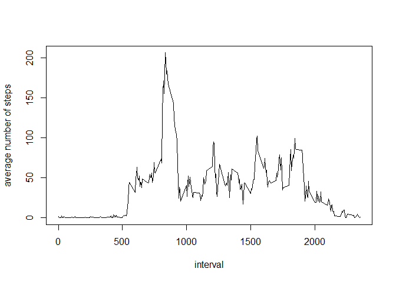
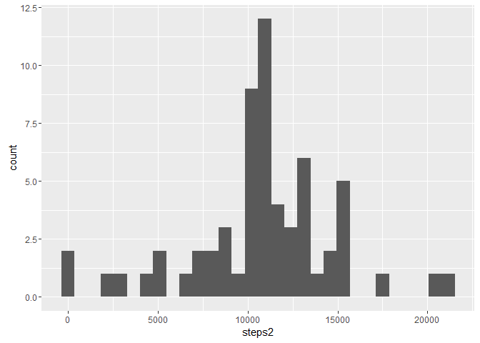

# Reproducible Research: Peer Assessment 1


## Loading and preprocessing the data


```r
zip <- 'C:/Users/sh/Documents/GitHub/RepData_PeerAssessment1/activity.zip'
unzip(zip)
file <- 'C:/Users/sh/Documents/GitHub/RepData_PeerAssessment1/activity.csv'
df <- read.csv(file)
```

## What is mean total number of steps taken per day?

```r
dates <- unique(df$date)
steps <- numeric()
for (i in 1:length(dates)) {
  steps[i] <- sum(df[df$date==dates[i],1])
}
library(ggplot2)
qplot(steps)
```

```
## `stat_bin()` using `bins = 30`. Pick better value with `binwidth`.
```

```
## Warning: Removed 8 rows containing non-finite values (stat_bin).
```

<!-- -->

```r
mean1 <- mean(steps, na.rm=TRUE)
median1 <- median(steps, na.rm=TRUE)
```
Mean number of steps per day = 1.0766189\times 10^{4}  
Median number of steps per day = 1.0765\times 10^{4}

## What is the average daily activity pattern?

```r
int <- unique(df$interval)
stepsInt <- numeric()
for (i in 1:length(int)) {
  stepsInt[i] <- mean(df[df$interval==int[i],1], na.rm=TRUE)
}
plot(int, stepsInt, type='l', ylab='average number of steps', xlab='interval')
```

<!-- -->

```r
maxSteps <- int[which.max(stepsInt)]
```
The 5-min interval that contains the maximum number of steps is the interval with identifier 835.

## Imputing missing values

```r
# find total number of missing values
naInd <- which(is.na(df[,1]))
totalNA <- length(naInd)
```
The total number of missing values is 2304.

```r
# replace missing values with mean of 5-min interval
df2 <- df
for (i in 1:length(naInd)) {
  obs <- naInd[i]
  df2[obs,1] <- stepsInt[which(int==df[obs,3])]
}
# calculate total number of steps per day after imputing missing values
steps2 <- numeric()
for (i in 1:length(dates)) {
  steps2[i] <- sum(df2[df2$date==dates[i],1])
}
qplot(steps2)
```

```
## `stat_bin()` using `bins = 30`. Pick better value with `binwidth`.
```

<!-- -->

```r
mean2 <- mean(steps2, na.rm=TRUE)
median2 <- median(steps2, na.rm=TRUE)
```
Mean number of steps per day = 1.0766189\times 10^{4}  
Median number of steps per day = 1.0766189\times 10^{4}  
Imputing missing data with the mean for the appropriate 5-minute interval has not changed the mean but has caused the median to increase. 

## Are there differences in activity patterns between weekdays and weekends?

```r
#create factor variable with levels "weekday" and "weekend"
df2$date <- as.Date(df2$date,'%Y-%m-%d')
for (j in 1:length(df2$date)) {
  if (weekdays(df2$date[j])=="Saturday" | weekdays(df2$date[j])=="Sunday")
    df2$day[j] <- "weekend"
  else df2$day[j] <- "weekday"
}
df2$day <- as.factor(df2$day)

# plot average steps of each 5-min interval across weekdays and weekends
stepsWday=numeric()
stepsWend=numeric()
for (i in 1:length(int)) {
  stepsWday[i] <- mean(df2[df2$interval==int[i] & df2$day=="weekday",1], na.rm=TRUE)
}
for (i in 1:length(int)) {
  stepsWend[i] <- mean(df2[df2$interval==int[i] & df2$day=="weekend",1], na.rm=TRUE)
}
df3<- rbind(data.frame(interval=int,steps=stepsWday,day=rep('weekday',length(int))),
            data.frame(interval=int,steps=stepsWend, day=rep('weekend',length(int))))
ggplot(df3, aes(interval,steps)) + geom_line() + facet_grid(day~.)
```

<!-- -->
